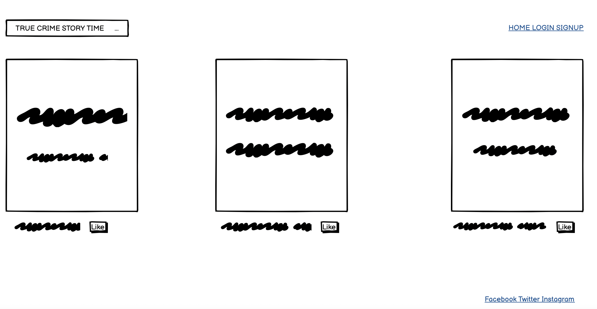
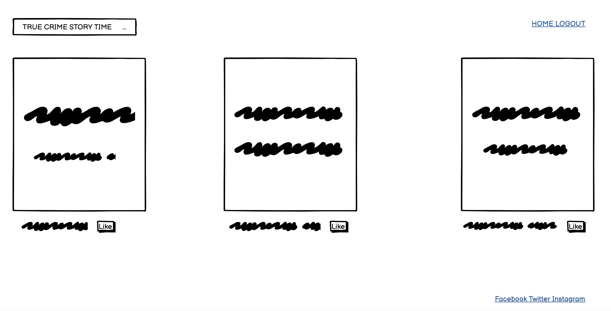
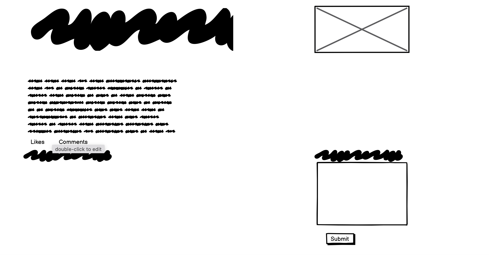
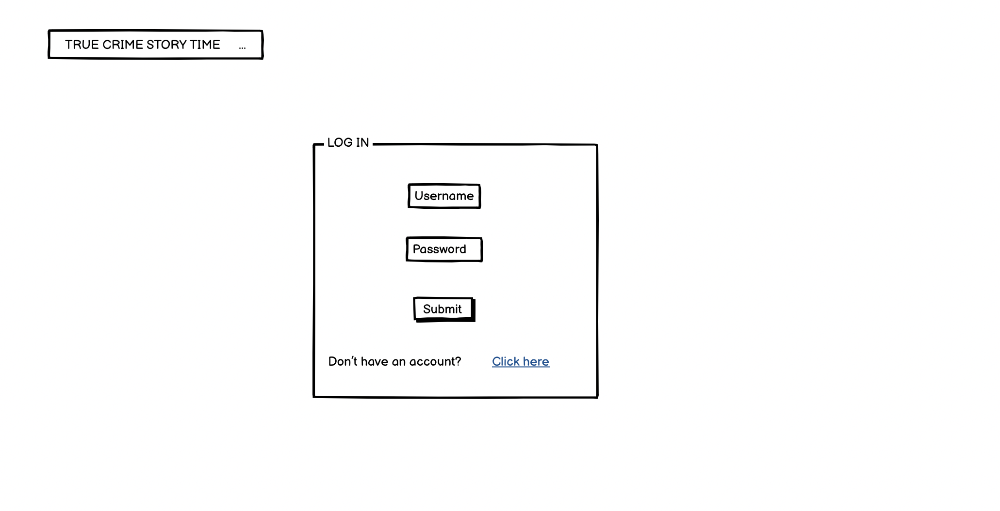
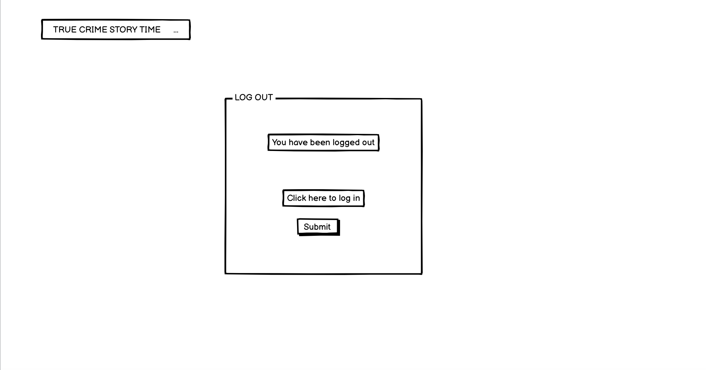

# True Crime Story Time #

This is a blogging website for true crime lovers to unite, read and discuss all things true crime.   It allows users to read blog posts as a member or non member.  Non members have the ability to sign up if they wish to interact with a blog post by commenting or liking.  

Admin has the ability to create, read, update and delete posts and comments.

# User Experience #

## General User Goals ##
- As a user, upon landing on the website, I want to know immediately what it is about
- As a user, I want to be able to browse a selection of true crime blog posts and choose which one I want to read
- As a user, I want to be able to click on a post to access the whole blog post
- As a user/admin, I want the number of likes on each post to be visible so that I can easily see which ones are popular

## Member User Goals ##
- As a user with an account, I want to be able to log in easily 
- As a user with an account, I want to be able to join a discussion about a true crime case by adding comments to posts 
- As a user with an account, I want to be able to like or unlike blog posts
- As a user with an account, I want to be able to log out 

## Non Member User Goals ##
- As a user without an account, I want to be able to browse and read blog posts
- As a user without an account, I want the option to sign up and create an account

## Admin User Goals ##
- As admin, I want to create, read, update and delete posts so that I can manage my blog content
- As admin, I want to be able to approve and disapprove comments so that I can filter out inappropriate comments
- As admin, I want the option to write draft posts that can be saved and posted later 

# Strategy 

# Scope 

# Structure 

# Skeleton 

## Landing Page (non member) 

<h2 align ="center"></h2>

## Landing Page (member) 

<h2 align ="center"></h2>

## Blog Post Page (member)

<h2 align ="center"></h2>

## Blog Post Page (non member)

<h2 align ="center"></h2>

## Log In Page 

<h2 align ="center"></h2>

## Log Out Page 

<h2 align ="center"></h2>

# Surface #

