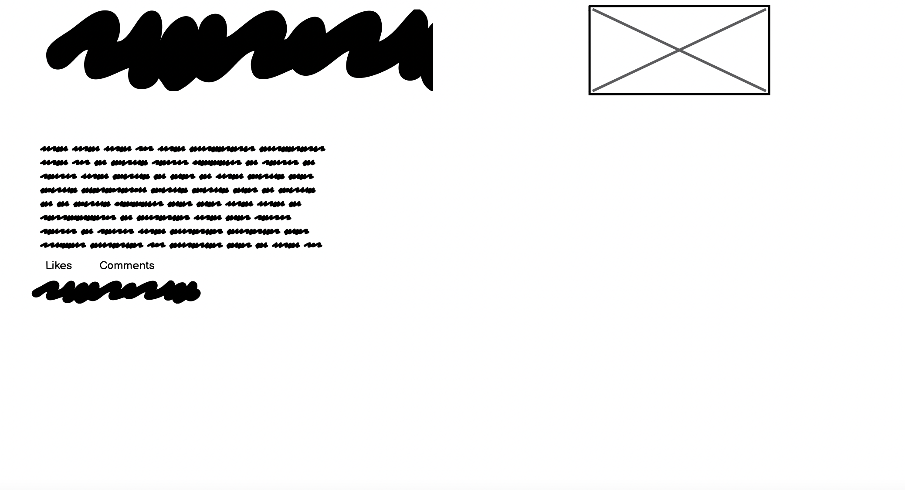

# True Crime Story Time #

This is a blogging website for true crime lovers to unite and read about some of the most famous spine-tingling true crime cases.   It allows users to read blog posts or like posts as a member.  Non-members have the ability to browse through blog posts and can sign up as a member if they wish to interact with a post with a like.  

Admin has the ability to create, read, update and delete posts.

You can view the live site [here](https://truecrimestorytime.herokuapp.com/)

<h2 align ="center"></h2>

# User Experience #

## User Stories ##

I used the Agile Methodology Tool on Github to plan my project and use as a to do list.  I would move the issues I was working on across from the To Do column to the In Progress column.  Completed issues would then be dragged across to the Done column.  

<h2 align ="center"></h2>

## General User Goals ##
- As a user, upon landing on the website, I want to know immediately what it is about
- As a user, I want to be able to browse a selection of true crime blog posts and choose which one I want to read
- As a user, I want to be able to click on a post to access the whole blog post
- As a user/admin, I want the number of likes on each post to be visible so that I can easily see which ones are popular
- As a user/admin, I want to be able to create an account and log in to view/read/create posts

## Member User Goals ##
- As a user with an account, I want to be able to log in easily and be remembered
- As a user with an account, I want to be able to like or unlike blog posts
- As a user with an account, I want to be able to log out 

## Non Member User Goals ##
- As a user without an account, I want to be able to browse and read blog posts
- As a user without an account, I want the option to sign up and create an account

## Admin User Goals ##
- As admin, I want to create, read, update and delete posts so that I can manage my blog content
- As admin, I want to be able to manage my blog content in the frontend and backend
- As admin, I want the option to write draft posts that can be saved and posted later 
- As admin, I want to be able to remove users from the site if required 
- As admin, I want to be able to upload an image on my post

## Relationship Diagram ##

<h2 align ="center"></h2>

# Design

## Colour Scheme
- Given the theme of the site, I wanted the colour scheme to align with this and give the user an eerie feeling.  I chose crimson and white as the background with black and white font.  

## Wireframes

Some features of the Wireframes changed slightly during development.

## Landing Page (non member) 

Non members are able to browse through blog posts, view number of likes on each post and have the option to sign up and create an account 

<h2 align ="center"></h2>

## Landing Page (member) 

Members are able to browse through blog posts, view number of likes on each post and have the option to log out.  The sign up link disappears for a logged in user.  

<h2 align ="center"></h2>

## Blog Post Page (member)

Members are able to like or unlike posts

<h2 align ="center"></h2>

## Blog Post Page (non member)

Non members can read blog posts without the option to like 

<h2 align ="center"></h2>

## Log In Page 

<h2 align ="center"></h2>

## Log Out Page 

<h2 align ="center"></h2>

# Features

## Navigation Bar
- The navigation bar is fully responsive.  It has links to log in, home, sign up and log out.  The logo to the left is also a link to the home page.

<h2 align ="center"></h2>

## Posts 

- Blog posts feature the author, blog post title, date and time stamps, likes and like count.  This section displays 3 posts and site pagination exists if more posts are created (next/prev).  Hover feature exists on next/prev links.

<h2 align ="center"></h2>

## Post Detail

- When a user clicks on a blog post, they are taken to a new page to read the full blog post.  This page also contains, author, blog post title, date and time stamps, likes and like count.  Users who are members are also able to like posts by clicking on the heart icon.  

<h2 align ="center"></h2>

## Footer 
- The footer has social links that are working.  

<h2 align ="center"></h2>

## Sign Up 
- Non members are able to create a new account via the sign up link.  Existing members can also log in from here.

<h2 align ="center"></h2>

## Login 
- Members can log into their account to like posts.  Non members can also sign up from here.

<h2 align ="center"></h2>

## Logout
- Members can log out of their account.

<h2 align ="center"></h2>

## Admin
- Admin is able to create, read, update and delete posts from the backend and frontend.  
- Images can be added to new or existing posts by Admin.  
- Likes can be monitored from the backend allowing Admin to see which users have liked what
- Posts can be saved as drafts from the frontend to the backend and finished later 
- Posts can be saved as drafts in the backend and finished later 
- Admin can delete selected users if necessary 

# Testing

## User Stories Testing

## General User Goals - Tests ##
As a user, upon landing on the website, I want to know immediately what it is about
- Users entering the website will immediately know the topic and theme of the site from the title and images
As a user, I want to be able to browse a selection of true crime blog posts and choose which one I want to read
- All users have access to all blog posts whether they have an account or not 
As a user, I want to be able to click on a post to access the whole blog post
- Users are directed to a new page to read the whole blog post when clicked 
As a user/admin, I want the number of likes on each post to be visible so that I can easily see which ones are popular
- There is a like count that is visible to members and non members in the front end and admin in the backend.
As a user/admin, I want to be able to create an account and log in to view/read/create posts
- Accounts can be created through the sign up link.  Admin can log into the admin site to manage the blog and create posts.

## Member User Goals - Tests##
As a user with an account, I want to be able to log in easily and be remembered
- Users can log in via the log in link and there is an option to tick the box for your details to be remembered.  Users will alway know they are logged in because the login link in the nav bar will disappear
As a user with an account, I want to be able to like or unlike blog posts
- Like/unlike functionality works by clicking on the heart icon and the like count is also visible to everyone
As a user with an account, I want to be able to log out 
- Users can sign out via the log out link

## Non Member User Goals - Tests ##
As a user without an account, I want to be able to browse and read blog posts
- Non members have access to all posts and number of likes on each post
As a user without an account, I want the option to sign up and create an account
- Non members can create an account through the sign up link 

## Admin User Goals  - Tests ##
As admin, I want to create, read, update and delete posts so that I can manage my blog content
- Admin can do all this through the backend and frontend site as I have created, edited and deleted test posts

As admin, I want the option to write draft posts that can be saved and posted later 
- Posts can be created and saved to post later from the frontend to the backend and from the backend to the backend

As admin, I want to be able to remove users from the site if required
- Admin has the option to delete users if required - this function is also working as I have added and deleted users

As admin, I want to be able to upload an image on my post
- I have tested uploading images and it can be done successfully

# Validator Tests

## HTML
<h2 align ="center"></h2>

## CSS
<h2 align ="center"></h2>

## Python
- PEP8 is currently down but I have tested for PEP8 compliance using pycodestyle.  I have no errors aside from lines being too long in settings.py and models.py.

## Lighthouse
Mobile:
<h2 align ="center"></h2>

Desktop:
<h2 align ="center"></h2>

# Bugs and Errors
- Once my site was deployed successfully to Heroku, my CSS was no longer applied locally.  I tried removing and re-adding the config var DISABLE_COLLECTSTATIC = 1 but this didn't resolve anything.  Tutor support managed to provide a walkaround that fixed it - added os.environ['DEVELOPMENT]="1" to env.py and then DEBUG = 'DEVELOPMENT' in os.environ to settings.py 

- My like count was not rendering and it turned out to be an indentation issue in models.py 

- I have been trying to add a category model but I keep getting migration errors - "django.db.utils.ProgrammingError: relation "blog_category" already exists" so I deleted my category model and started again because it crashed my whole site.  Still no luck as I got a new error - "You are trying to add a non-nullable field 'category' to post without a default; we can't do that (the database needs something to populate existing rows).
Please select a fix:
 1) Provide a one-off default now (will be set on all existing rows with a null value for this column)
 2) Quit, and let me add a default in models.py
Select an option:" 
I selected 2 and added default=1 to my category line in models.py and it is still throwing an error.  I deleted it all and tried again and now I have this error - NameError: name 'AddCategory' is not defined.  I have (self) passed through because I believe this is the solution for NameError but I am having no luck.  I have deleted my Category model from my project because only a yellow error page was showing.    

# Future Development

- I would like users to be able to comment and add their own blog posts 
- Add categories to the blog posts 

# Technologies

## Languages
- HTML5
- CSS3
- JavaScript
- Python3

## Frameworks, Libraries & Programs
- Balsamiq -
Balsamiq was used for wireframes
- Bootstrap -
Bootstrap templates
- Cloudinary -
Cloudinary was used to store the placeholder image
- Pexels 
Images uploaded to blog from Admin site 
- Django -
Django built the app
- Django Allauth -
Django allauth for account creation and management
Font Awesome -
- Font Awesome was used for the like heart icon
- Google Fonts -
Imported fonts used from Google Fonts
- Heroku -
Heroku was used for hosting and deploying the site
- PostgreSQL -
PostgreSQL for database management
- Summernote -
Summernote WYSIWYG for Bootstrap
- Gitpod and Github
- Crispy Forms
Used for create, update, delete function for Admin

# Credit 
- Code Institute - I Think Therefore I Blog walkthrough videos and code 
- Youtuber Bek Brace - Build Blog Website with Django tutorial 
- Wikipedia - blog post content 
- History.com - blog post content
- Stackoverflow
- Tutor Support
- Fellow students on Slack
- Posts on Slack - Admin permissions/CRUD in the frontend
- geeksforgeeks.org - Admin permissions/CRUD in the frontend
- My mentor 

